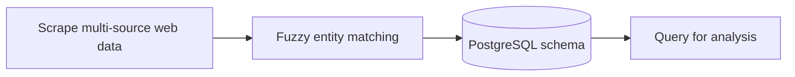

> **ETL pipeline** that consolidates fragmented web data into a queryable PostgreSQL source of truth — the foundation any analytics function depends on.

# College Baseball Data Collection System

## Pipeline



A Python application that scrapes college baseball statistics from Baseball Reference and draft information from Baseball America, then stores all data in PostgreSQL with drafted player flags.

## Features

- Scrapes hitting and pitching statistics from Baseball Reference for 4 major college conferences
- Scrapes draft results from Baseball America
- Stores all data in PostgreSQL for easy querying and analysis
- Automatically matches players between sources by name and school
- Flags drafted players in the database

## Prerequisites

- Python 3.7 or higher
- PostgreSQL 12 or higher
- pip (Python package manager)

## Installation

1. **Clone or navigate to the project directory:**
   ```bash
   cd "College Analysis"
   ```

2. **Create a virtual environment (recommended):**
   ```bash
   python3 -m venv venv
   source venv/bin/activate  # On Windows: venv\Scripts\activate
   ```

3. **Install dependencies:**
   ```bash
   pip install -r requirements.txt
   ```

4. **Set up PostgreSQL:**
   - Install PostgreSQL if not already installed
   - Create a database (or the script will create it automatically):
     ```sql
     CREATE DATABASE college_baseball;
     ```

5. **Configure database connection:**
   
   Create a `.env` file in the project root (optional, defaults are provided):
   ```env
   DB_HOST=localhost
   DB_PORT=5432
   DB_NAME=college_baseball
   DB_USER=postgres
   DB_PASSWORD=your_password
   ```
   
   Alternatively, you can modify the default values in `config.py`.

## Usage

1. **Ensure PostgreSQL is running** and accessible with the configured credentials.

2. **Run the main script:**
   ```bash
   python main.py
   ```

3. **The script will:**
   - Create the database if it doesn't exist
   - Create all necessary tables
   - Scrape hitting stats for all 4 conferences
   - Scrape pitching stats for all 4 conferences
   - Scrape draft results from Baseball America
   - Match players and flag drafted status
   - Display summary statistics

## Database Schema

### Tables

- **conferences**: Stores conference information
- **players**: Master player table with draft status
- **hitting_stats**: Detailed hitting statistics for each player/season
- **pitching_stats**: Detailed pitching statistics for each player/season
- **draft_results**: Draft information from Baseball America

### Key Fields

**players table:**
- `drafted`: Boolean flag indicating if player was drafted
- `draft_year`, `draft_round`, `draft_pick`, `draft_team`: Draft details

**hitting_stats table:**
- Games, at-bats, runs, hits, doubles, triples, home runs, RBI
- Walks, strikeouts, AVG, OBP, SLG, OPS
- Stolen bases, caught stealing, and more

**pitching_stats table:**
- Games, games started, complete games, shutouts
- Wins, losses, saves, innings pitched
- ERA, WHIP, strikeouts, walks, and more

## Configuration

### Conference IDs

The system is configured to scrape 4 conferences. Conference IDs are defined in `config.py`:

- Conference 1: `00e321b3`
- Conference 2: `7beb4f46`
- Conference 3: `82d1384a`
- Conference 4: `eff09df9`

To modify conference names or add more conferences, edit the `CONFERENCES` dictionary in `config.py`.

### Scraping Settings

Adjust scraping behavior in `config.py`:
- `REQUEST_DELAY`: Seconds to wait between requests (default: 2)
- `REQUEST_TIMEOUT`: Request timeout in seconds (default: 30)

## Querying the Data

Once data is collected, you can query it using any PostgreSQL client or Python:

```python
import psycopg2
from config import DB_CONFIG

conn = psycopg2.connect(**DB_CONFIG)
cursor = conn.cursor()

# Example: Get all drafted players
cursor.execute("""
    SELECT name, school, draft_year, draft_round, draft_pick, draft_team
    FROM players
    WHERE drafted = TRUE
    ORDER BY draft_year DESC, draft_round, draft_pick
""")

for row in cursor.fetchall():
    print(row)
```

## Project Structure

```
College Analysis/
├── main.py                          # Main orchestration script
├── database.py                      # PostgreSQL connection and schema
├── config.py                        # Configuration settings
├── scraper_baseball_reference.py    # Baseball Reference scraper
├── scraper_baseball_america.py      # Baseball America scraper
├── data_processor.py                # Player matching and processing
├── requirements.txt                 # Python dependencies
├── README.md                        # This file
└── .env                            # Environment variables (create this)
```

## Error Handling

The script includes comprehensive error handling and logging:
- Failed requests are logged but don't stop the process
- Database errors are caught and logged
- Player matching uses fuzzy matching for name/school variations
- Unmatched draft results are reported at the end

## Notes

- The script respects website rate limits with delays between requests
- Data is stored with ON CONFLICT handling, so re-running the script will update existing records
- Player matching uses both exact and fuzzy matching algorithms
- All timestamps are automatically recorded for data tracking

## Troubleshooting

**Database connection errors:**
- Verify PostgreSQL is running: `pg_isready`
- Check credentials in `.env` or `config.py`
- Ensure database user has CREATE DATABASE privileges

**Scraping errors:**
- Check internet connection
- Verify URLs are accessible
- Website structure may have changed - check HTML structure

**No matches found:**
- Review unmatched draft results in the output
- Check if name/school formats differ between sources
- Adjust fuzzy matching logic in `data_processor.py` if needed

## License

This project is for educational and personal use. Please respect the terms of service of Baseball Reference and Baseball America when using this scraper.

